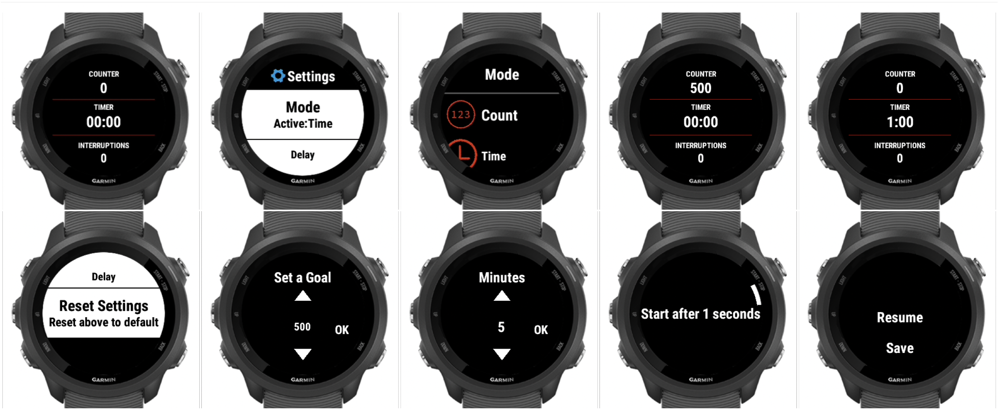

JumpJump -- A Garmin app

:star: Star us on GitHub — it helps!

[JumpJump](https://apps.garmin.com/en-US/apps/dc6ceca8-6ec6-49f2-b711-4ebc0d347177) is an awesome jumping rope app for the Garmin watch! You can download this app in the Garmin Connect IQ Store.

## Table of content

- [Installation](#installation)
- [Overview](#overview)
- [Privacy Policy](#privacy-policy)
- [捐赠Donations](#donations)

## Installation
[JumpJump](https://services.garmin.com/appsLibraryBusinessServices_v0/rest/apps/dc6ceca8-6ec6-49f2-b711-4ebc0d347177/icon/0ff22b34-19de-40e4-bce6-bbfbe0cca502)

## Overview

## Privacy Policy
[隐私协议Privacy Policy](./privacy-policy.md)

## Donations
如果此软件能帮助你解决计量跳绳的烦恼, 欢迎给我捐赠. 你的支持将是我持续更新的动力.
Developing is a hobby to me. if you do enjoy this app, you can buy me a marathon energy gel.

### Ways to Donation
#### Paypal
https://paypal.me/lichuanyi?locale.x=en_US

#### By me a marathon energy gel

#### 支付宝&微信支付
