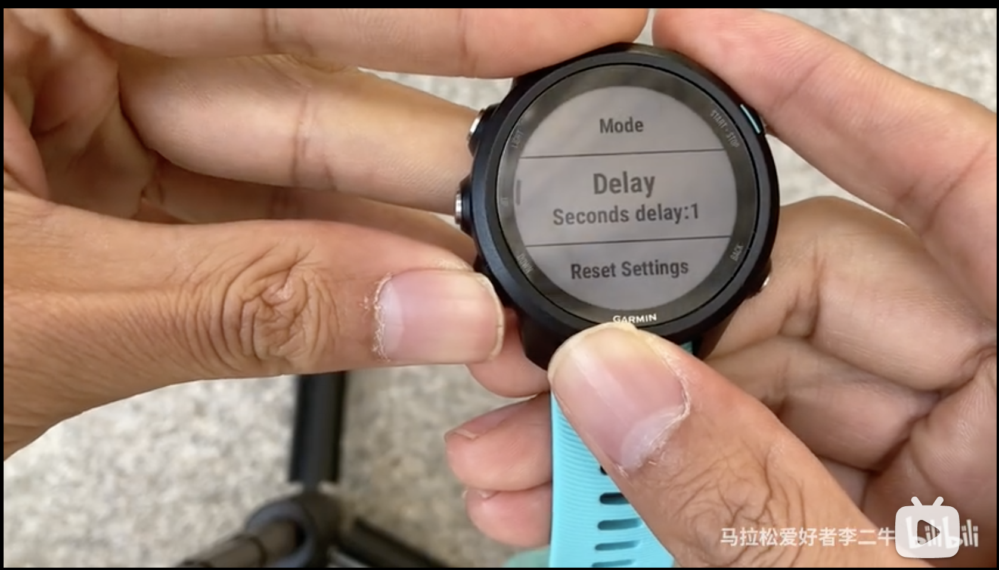

# JumpJump

> A Garmin app for jumping rope. 一款佳明平台跳绳app

:star: Star me on GitHub — it helps!
[跳一跳](https://apps.garmin.com/en-US/apps/dc6ceca8-6ec6-49f2-b711-4ebc0d347177) 现在已经在佳明应用市场上架, 并曾经登上Trending app的榜首.

---

---

[JumpJump](https://apps.garmin.com/en-US/apps/dc6ceca8-6ec6-49f2-b711-4ebc0d347177) is an awesome jumping rope app for your Garmin watch! You can download this app in the Garmin Connect IQ Store in which this app used to be ranked first.

---

---

## Table of content

- [安装 Installation](#installation)
- [UI一览 Overview](#overview)
- [更新记录ChangeLog](#changelog)
- [隐私协议 Privacy Policy](#privacy-policy)
- [捐赠 Donations](#donations)

## Installation

[JumpJump](https://services.garmin.com/appsLibraryBusinessServices_v0/rest/apps/dc6ceca8-6ec6-49f2-b711-4ebc0d347177/icon/0ff22b34-19de-40e4-bce6-bbfbe0cca502)

- Mode: Default mode, Time mode (set the jumping time, timer will count down as time passes after the start) and Count mode (set the number of jumping ropes, count down with the number of jumping ropes after the start)
- Delayed start: You can set a preparation time, the default is 3 seconds.
- Review history: Open Garmin connect. The record will show as a Strength Training. Click the tab and switch to the second tab, the summary info shows at the bottom.

- 模式：默认模式、定时模式（设置跳绳时间，开始后时间会倒数）和定量模式（设置跳绳数量，开始后随着跳绳数量倒数）
- 延迟开始：你可以设置一个准备时间，默认是3秒。
- 查看历史记录:打开Garmin connect, 运动记录将会以力量训练的形式展示. 点击一条记录,切换到第二个标签页,最下方的总结将会展示出此次跳绳的一些信息.

## Overview

## ChangeLog

- [v0.9] 2021-03-31
  愚人节快乐!修复某些数据字段越界问题.Happy April Fools' Day.Fix the problem of some data field numbers out of bounds.
- [v0.8] 2021-03-30
  修复一些问题. Fix some bugs.
- [v0.7] 2021-03-29
  移除735xt支持. Remove 735xt from the support list.
- [v0.6] 2021-03-29
  加上一个彩蛋,几个月后会触发.重构部分代码. Add an Easter egg, which will be triggered several months later; Refactor some code.
- [v0.5] 2021-03-29
  增加版本和重置模式菜单,修复了几个会导致崩溃的问题. Add new menu items 'Version' & 'Reset mode'; Fix some crash bugs
- [v0.4] 2021-03-27
  增加震动和声音反馈. Add vibration and sound feedback;
- [v0.3] 2021-03-26
  修复模式切换的问题.Connect总结页底部增加中断次数字段.Fix mode switching bugs; Add 'interruptions' data field at the bottom of Connect summary page.
- [v0.2] 2020-03-25
  解决一些导致异常崩溃的问题. Fix some problems that may cause an unexpected crash.
- [v0.1] 2021-03-24
  首次发布. The first release.

## Privacy Policy

[隐私协议 Privacy Policy](./privacy-policy.md)

## Donations

如果此软件能帮助你解决计量跳绳的烦恼, 欢迎给我捐赠. 你的支持将是我持续更新的动力.
Developing is a hobby to me. if you do enjoy this app, you can buy me a marathon energy gel.

### Ways to Donation

#### Paypal

#### By me a marathon energy gel

#### 支付宝&微信支付

